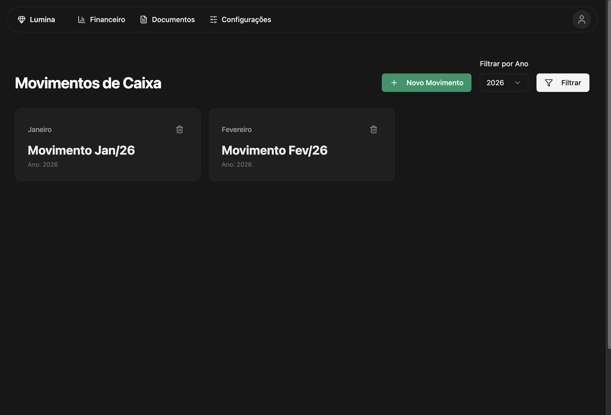
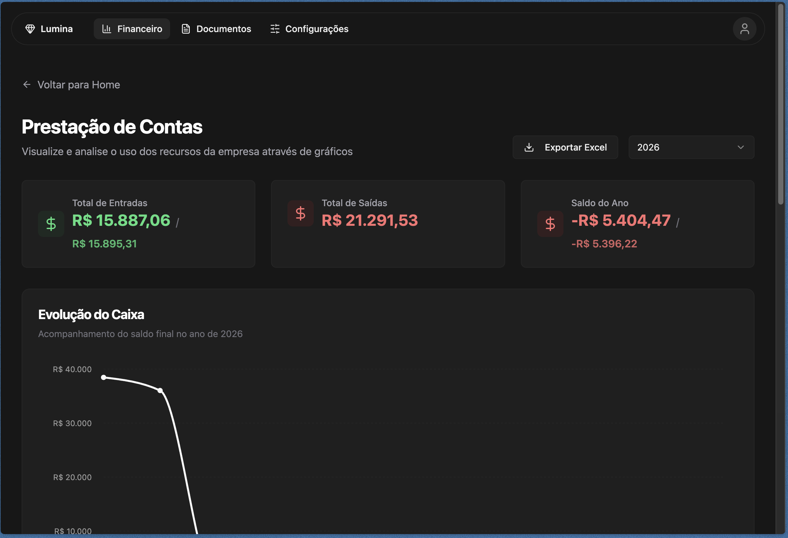

# Lumina

Aplicação web de gestão financeira e prestação de contas, desenvolvida com foco em clareza operacional, controle de movimentações e visualização estratégica dos dados.

Este projeto foi pensado como um produto real: autenticação segura, fluxo de caixa mensal, consolidação de entradas e saídas, dashboards analíticos e exportação de relatórios para formatos utilizados no dia a dia corporativo.

## Visão Geral

O `Lumina` centraliza a operação financeira em uma interface moderna, rápida e responsiva. A proposta é simplificar o acompanhamento de movimentações, apoiar a tomada de decisão e facilitar a geração de relatórios para auditoria, acompanhamento gerencial e prestação de contas.

## Preview da Aplicação

<p align="center">
  
  
</p>

## Principais Funcionalidades

- Gestão de movimentos de caixa por mês e ano.
- Cadastro e acompanhamento de entradas e saídas financeiras.
- Resumo financeiro com saldos, aplicações e resgates.
- Dashboard analítico com gráficos para prestação de contas.
- Exportação de dados para `.xlsx` e relatórios em `.docx`.
- Autenticação por link mágico via e-mail.
- Controle de permissões com diferenciação de usuário administrador.
- Interface responsiva com foco em usabilidade em desktop e mobile.

## Diferenciais Técnicos

- Arquitetura frontend moderna com `React 19`, `TypeScript` e `Vite`.
- Roteamento tipado com `@tanstack/react-router`.
- Persistência e autenticação com `Supabase`.
- Formulários com `react-hook-form` e validação com `zod`.
- Design system com componentes reutilizáveis e base em `Radix UI`.
- Estilização com `Tailwind CSS`, priorizando consistência visual e velocidade de iteração.
- Visualização de dados com `Recharts`.
- Feedback de interação com loaders globais, toasts e estados de carregamento.

## O Que Este Projeto Demonstra

- Capacidade de transformar regras de negócio em uma interface clara e funcional.
- Organização de código em componentes, páginas, serviços e utilitários.
- Integração com backend BaaS para autenticação e operações de dados.
- Implementação de permissões e controle de sessão no frontend.
- Geração de relatórios e exportações úteis para operação empresarial.
- Atenção a experiência do usuário, responsividade e refinamento visual.

## Stack

- `React`
- `TypeScript`
- `Vite`
- `Tailwind CSS`
- `Radix UI`
- `TanStack Router`
- `React Hook Form`
- `Zod`
- `Supabase`
- `Recharts`
- `xlsx`
- `docx`

## Como Executar Localmente

### 1. Instale as dependências

```bash
npm install
```

### 2. Configure as variáveis de ambiente

Crie um arquivo `.env` na raiz do projeto com:

```env
VITE_SUPABASE_URL=your_supabase_url
VITE_SUPABASE_PUBLISHABLE_KEY=your_supabase_publishable_key
```

### 3. Inicie o ambiente de desenvolvimento

```bash
npm run dev
```

### 4. Gere a build de produção

```bash
npm run build
```

## Perfil do Projeto

Este repositório representa um case de produto com foco em:

- organização financeira;
- acompanhamento operacional;
- apoio à gestão;
- prestação de contas com visão analítica;
- experiência de uso consistente em diferentes tamanhos de tela.

## Considerações Finais

O `Lumina` evidencia uma combinação de visão de produto, cuidado com UX e implementação técnica sólida no ecossistema React. Para contextos de avaliação profissional, ele demonstra capacidade de construir interfaces orientadas a negócio, com dados reais, autenticação, regras de acesso e geração de relatórios.
